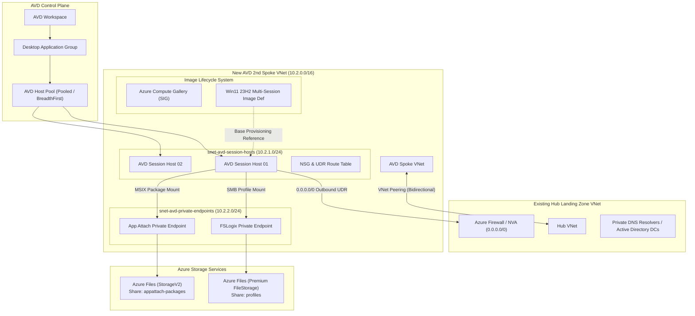
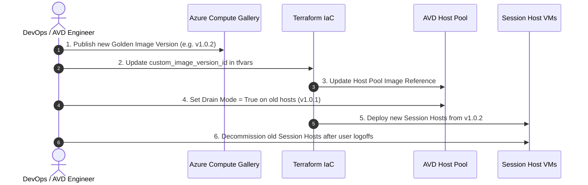

# High-Level Design (HLD) Document
## Azure Virtual Desktop (AVD) 2nd Spoke Landing Zone Integration

**Project**: Automated AVD Infrastructure & Spoke Landing Zone Deployment  
**Architecture**: Hub-and-Spoke Enterprise Architecture  
**Target Repository**: [https://github.com/sam6shk/AVD_IaC_Spoke_Demo.git](https://github.com/sam6shk/AVD_IaC_Spoke_Demo.git)  
**Date**: September 2026  

---

## 📋 Executive Summary

This document defines the High-Level Design (HLD) for expanding an existing Azure Landing Zone by deploying a **dedicated 2nd Spoke Virtual Network** specifically tailored for **Azure Virtual Desktop (AVD)** workloads.

The solution satisfies key enterprise requirements:
1. **Infrastructure as Code (IaC)**: 100% automated deployment using Terraform.
2. **Hub-and-Spoke Integration**: Seamless connection to the customer's existing Hub Landing Zone via bi-directional VNet Peering and forced tunneling UDR (`0.0.0.0/0`) through central Firewall/NVA.
3. **Simplified Host Pool Image Lifecycle**: Image definitions and versions managed via **Azure Compute Gallery (SIG)** for zero-downtime rolling updates.
4. **Dynamic Application Delivery**: **MSIX App Attach** to decouple applications from the core OS image.
5. **Profile Management**: **FSLogix Profile Containers** hosted on Premium Azure Files Shares secured via **Private Endpoints**.

---

## 🏗️ 1. High-Level Architecture Diagram



---

## 🌐 2. Networking Architecture & Subnet Topology

### Network Address Space Allocation

| Resource | CIDR Block | Purpose |
| :--- | :--- | :--- |
| **AVD Spoke VNet** | `10.2.0.0/16` | Main Spoke Address Space |
| **snet-avd-session-hosts** | `10.2.1.0/24` | Dedicated Subnet for Session Host VMs |
| **snet-avd-private-endpoints** | `10.2.2.0/24` | Dedicated Subnet for Storage Private Endpoints |

### Routing & Security Control

- **User Defined Route (UDR)**: Associated with `snet-avd-session-hosts`. Routes `0.0.0.0/0` outbound traffic directly to the Hub Azure Firewall IP (`10.1.0.4`).
- **Network Security Group (NSG)**: Restricted inbound (Management RDP within VNet) and permitted outbound to `WindowsVirtualDesktop` service tags, HTTPS (`443`), and KMS (`1688`).
- **VNet Peering**: Bi-directional peering (`spoke-to-hub` & `hub-to-spoke`) with `allow_forwarded_traffic = true`.

---

## 🖼️ 3. Simplified Host Pool Image Update System



### Image Management Architecture
- **Central Storage**: Azure Compute Gallery (Shared Image Gallery) stores standard Windows 11 Enterprise Multi-session 23H2 golden images.
- **Zero-Downtime Rollout**: Allows seamless session host replacement without destroying or recreating the core AVD Host Pool control plane.

---

## 💾 4. Profile Management & App Attach Architecture

### FSLogix Profile Containers
- **Storage Tier**: Premium Azure Files FileStorage (`account_kind = "FileStorage"`, `account_tier = "Premium"`, `ZRS` replication).
- **Private Access**: Connected to `snet-avd-private-endpoints` with `privatelink.file.core.windows.net` Private DNS Link.
- **Authentication**: Supports Azure AD / Entra ID Kerberos (`AADKERB`) authentication over SMB.
- **Automated Registry Provisioning**: Executed via VM Custom Script Extension during deployment:
  ```powershell
  HKLM:\SOFTWARE\FSLogix\Profiles\Enabled = 1
  HKLM:\SOFTWARE\FSLogix\Profiles\VHDLocations = "\\<storage_name>.file.core.windows.net\profiles"
  HKLM:\SOFTWARE\FSLogix\Profiles\FlipFlopProfileDirectoryName = 1
  HKLM:\SOFTWARE\FSLogix\Profiles\SizeInMB = 30000
  ```

### MSIX App Attach Package Storage
- Dedicated Storage Account with File Share `appattach-packages`.
- Stores packaged application containers (`.vhdx` / `.cim`) that dynamically mount to Session Hosts at user login.

---

## 🛡️ 5. Security & Governance

1. **Zero Public Storage Endpoints**: Storage Accounts enforce `public_network_access_enabled = false`.
2. **Centralized Network Inspection**: All internet and cross-spoke traffic is inspected by Hub Firewall/NVA.
3. **Identity Management**: Native Entra ID Join (`AADLoginForWindows`) extension installed on all Session Hosts.
4. **Data Protection**: OS Disks configured with `Premium_LRS` and Azure Storage encrypted with Microsoft Managed / KMS keys.

---

## 🚀 6. Execution & Deployment Summary

The implementation is structured into modular HCL files:
- [`providers.tf`](file:///d:/Revision-2026/AVD-LandingZone/providers.tf) - Terraform & Azure Provider declarations.
- [`variables.tf`](file:///d:/Revision-2026/AVD-LandingZone/variables.tf) - Parameter definitions.
- [`network.tf`](file:///d:/Revision-2026/AVD-LandingZone/network.tf) - Network topology, subnets, UDR, NSG & Peering.
- [`compute_gallery.tf`](file:///d:/Revision-2026/AVD-LandingZone/compute_gallery.tf) - Azure Compute Gallery definition.
- [`storage_fslogix.tf`](file:///d:/Revision-2026/AVD-LandingZone/storage_fslogix.tf) - FSLogix Profile storage & Private Endpoint.
- [`storage_appattach.tf`](file:///d:/Revision-2026/AVD-LandingZone/storage_appattach.tf) - MSIX App Attach storage & Private Endpoint.
- [`avd_core.tf`](file:///d:/Revision-2026/AVD-LandingZone/avd_core.tf) - AVD Control plane (Workspace, Host Pool, DAG).
- [`avd_session_hosts.tf`](file:///d:/Revision-2026/AVD-LandingZone/avd_session_hosts.tf) - Session Host VMs & Extensions.
- [`outputs.tf`](file:///d:/Revision-2026/AVD-LandingZone/outputs.tf) - Deployment outputs.
