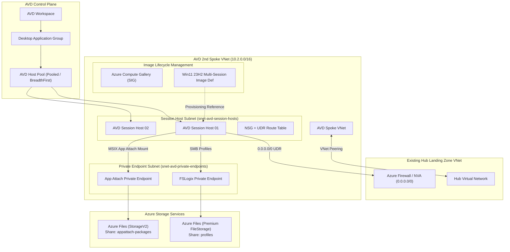

# Azure Virtual Desktop (AVD) 2nd Spoke Landing Zone

[](https://www.terraform.io/)
[](https://azure.microsoft.com/)
[](https://learn.microsoft.com/en-us/fslogix/)
[](https://learn.microsoft.com/en-us/azure/virtual-desktop/app-attach-overview)

Production-ready Terraform implementation for deploying an **Azure Virtual Desktop (AVD) 2nd Spoke Landing Zone** integrated into an existing Enterprise Hub-and-Spoke topology.

This architecture includes **FSLogix Profile Containers**, **MSIX App Attach** for application delivery, and an **Azure Compute Gallery (Shared Image Gallery)** for simplified image updates.

---

## 🏛️ High-Level Architecture (HLD)



---

## ✨ Key Architectural Features

### 1. Hub-and-Spoke Network Integration
- **Isolated AVD Spoke VNet**: `10.2.0.0/16` with dedicated subnets for Session Hosts (`10.2.1.0/24`) and Storage Private Endpoints (`10.2.2.0/24`).
- **Bi-directional VNet Peering**: Directly peers with the existing Hub VNet (`remote_virtual_network_id`).
- **Centralized Security Routing**: User Defined Route (UDR) forces all outbound `0.0.0.0/0` traffic through the Hub Azure Firewall / NVA.

### 2. Simplified Host Pool Image Update System (Azure Compute Gallery)
- Centralized image management using **Azure Compute Gallery (Shared Image Gallery)**.
- **Zero-Downtime Image Rollout Procedure**:
  1. Build a new image version in the Azure Compute Gallery (`win11-23h2-avd-golden-image`).
  2. Set `use_custom_gallery_image = true` and update `custom_image_version_id` in `terraform.tfvars`.
  3. Enable Drain Mode on existing hosts, deploy new hosts from the new image version, and gracefully decommission old hosts.

### 3. Profile Management with FSLogix
- **High-Performance Storage**: Premium FileStorage Account with File Share (`profiles`) accessed securely over **Private Endpoint** (`privatelink.file.core.windows.net`).
- **Automated Host Configuration**: Session Hosts automatically provisioned with FSLogix registry keys via Custom Script Extension (`Enabled=1`, `VHDLocations`, `FlipFlopProfileDirectoryName=1`).

### 4. Dynamic Application Delivery with MSIX App Attach
- Dedicated File Share (`appattach-packages`) backed by Private Endpoint for storing application `.vhdx` / `.cim` containers.
- Decouples applications from the core OS image, accelerating patch management and reducing image maintenance overhead.

---

## 📂 Repository Structure

```text
AVD-LandingZone/
├── providers.tf            # Provider configuration (azurerm, azuread, random)
├── variables.tf            # Input variable declarations & defaults
├── terraform.tfvars.example# Sample deployment configuration template
├── network.tf              # Spoke VNet, Subnets, UDR, NSG & Hub VNet Peering
├── compute_gallery.tf      # Azure Compute Gallery & Image Definition
├── storage_fslogix.tf      # FSLogix Storage Account, Share, PE & Private DNS
├── storage_appattach.tf    # App Attach Storage Account, Share & PE
├── avd_core.tf             # Workspace, Host Pool, App Group & Reg Token
├── avd_session_hosts.tf    # VMs, Entra ID Join, AVD DSC Agent & FSLogix script
├── outputs.tf              # Deployment output IDs, UNC paths, and IP addresses
└── README.md               # Architecture documentation & execution guide
```

---

## 📋 Prerequisites

Before deploying this solution, ensure you have:

1. **Terraform CLI**: `>= 1.5.0` installed.
2. **Azure CLI**: `az login` executed with an active Azure subscription context.
3. **Azure RBAC Permissions**: `Contributor` and `User Access Administrator` on the target subscription/resource groups.
4. **Existing Hub Landing Zone Details**:
   - Hub Virtual Network Name & Resource Group
   - Hub Virtual Network Resource ID
   - Hub NVA / Firewall Private IP (for default routing)

---

## 🚀 Deployment Guide

### Step 1: Clone Repository & Create Configuration File
```bash
git clone <repository-url>
cd AVD-LandingZone
cp terraform.tfvars.example terraform.tfvars
```

### Step 2: Edit `terraform.tfvars`
Update `terraform.tfvars` with your target environment parameters:

```hcl
location                = "eastus2"
prefix                  = "avd-spk"
environment             = "prod"

# Reference to your existing Hub VNet
hub_vnet_name           = "vnet-hub-prod-eastus2"
hub_vnet_id             = "/subscriptions/<SUB_ID>/resourceGroups/rg-hub-network-prod/providers/Microsoft.Network/virtualNetworks/vnet-hub-prod-eastus2"
hub_resource_group_name = "rg-hub-network-prod"
hub_nva_firewall_ip     = "10.1.0.4"

# AVD Spoke Subnets
spoke_vnet_address_space         = ["10.2.0.0/16"]
session_hosts_subnet_prefix      = ["10.2.1.0/24"]
private_endpoints_subnet_prefix = ["10.2.2.0/24"]

# Host Pool & Session Hosts
session_host_count    = 2
vm_size               = "Standard_D4ds_v5"
local_admin_username  = "avdadmin"
local_admin_password  = "YourSecurePassword123!"
```

### Step 3: Initialize & Validate Terraform
```bash
terraform init
terraform validate
```

### Step 4: Preview Infrastructure Plan
```bash
terraform plan -out=tfplan
```

### Step 5: Deploy Infrastructure
```bash
terraform apply tfplan
```

---

## 🔄 Post-Deployment Operations

### Updating Host Pool Image via Azure Compute Gallery

To rollout a new golden image version:
1. Publish the new version to the Azure Compute Gallery (`win11-23h2-avd-golden-image`).
2. Update `terraform.tfvars`:
   ```hcl
   use_custom_gallery_image = true
   custom_image_version_id  = "/subscriptions/<SUB_ID>/resourceGroups/rg-avd-spk-prod-eastus2/providers/Microsoft.Compute/galleries/sigavdspkprod/images/win11-23h2-avd-golden-image/versions/1.0.1"
   ```
3. Run `terraform apply`.

### Configuring MSIX App Attach Packages
1. Upload `.vhdx` / `.cim` application packages to the UNC Share:
   `\\<stappattach_name>.file.core.windows.net\appattach-packages`
2. Register the MSIX Package in Azure Portal under **Azure Virtual Desktop -> App Attach packages**.
3. Assign the package to the Application Group (`vdag-desktop-avd-spk-prod`).

---

## 🛡️ Security & Compliance

- **No Public Endpoints**: Storage Accounts enforce `public_network_access_enabled = false` and rely strictly on Private Endpoints.
- **Traffic Inspection**: Forced tunneling (`0.0.0.0/0`) sends all egress traffic to the Hub NVA/Firewall.
- **Identity & Access**: Session hosts support Entra ID Join (`AADLoginForWindows`) and Entra ID Kerberos SMB authentication for FSLogix file shares.

---

## 📄 License
Internal Infrastructure as Code Template - Designed for Enterprise Landing Zone Integration.
